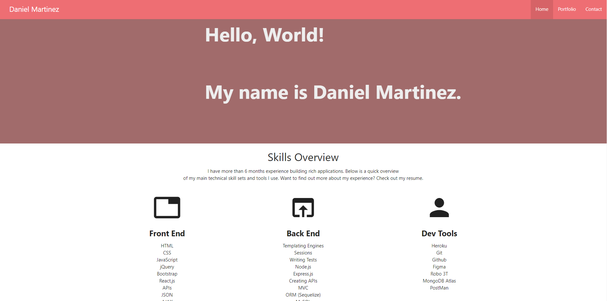

# react-portfolio

## Table of Contents
* [Description](#description)
* [Installation](#installation)
* [Tools](#Tools)
* [Questions](#questions)
* [Screenshot](#screenshot)
* [Deployment](#deployment)
* [Credits](#credits)

## Description
react-portfolio is my portfolio! Take a look! I created this application to put my react skills to the test. And also more importantly, to re-do my portfolio. 
There will be future updates as it is not up to my standards yet as far as content and styling. Mobile responsiveness will also be coming in the future. 

## Installation
Follow these steps to view the application!

1. Open link in (Github.) [https://github.com/xdanielmtz/react-portfolio]
2. Clone with SSH Key
3. Run `git clone` command in Terminal with the pasted link
4. Run `code .` command to open in VS Code.
5. Run `npm install` to install all dependencies
6. Run `npm start` to initialize the server on your local if you wish to view it there.
7. Enjoy

## Tools
The tools I used to create this application are: 
React.Js - Front-end Library in which I used to accomplish nearly everything for this application
Materialize - CSS library I utilized for the styling

## Questions
If you have any questions contact me through email:
    (Daniel Martinez) - [xdanielmtz@gmail.com]

## Screenshot

## Deployment

## Credits
I would like to give credits to my instructor, Jonathan Watson for providing me with the information needed to complete this assignment. 